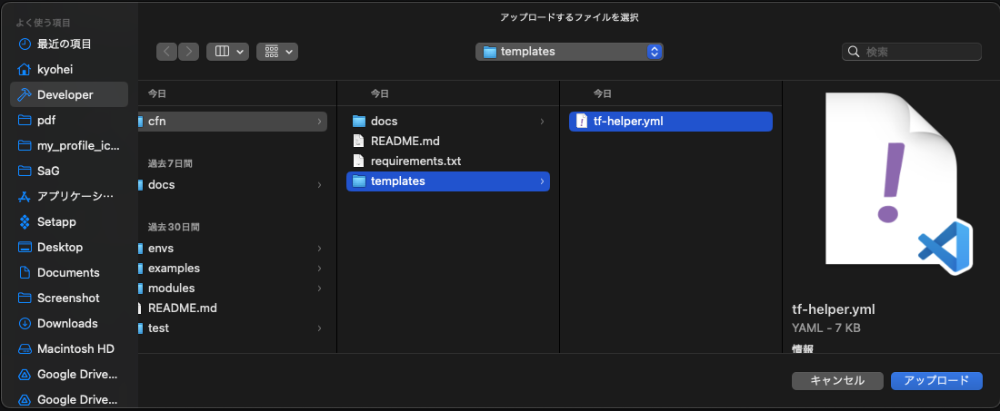
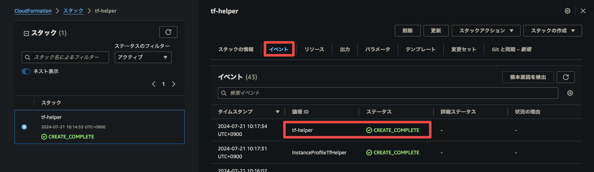
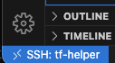

# sample-cfn

`templates/tf-helper.yml` は EC2 インスタンス（`tf-helper`）を作成する CloudFormation テンプレートです。

ローカルから `tf-helper` に SSH 接続して、Terraform の開発と実行などの作業を行うことを想定しています。

## 使い方

以下の手順で、VSCode を利用した `tf-helper` 上での CloudFormation 開発環境を構築します。

### 0. リポジトリのクローン

1. このリポジトリをクローンします。

    ```bash
    git clone <URL>
    ```

### 1. tf-helper の作成

> [!NOTE]
> AWS コンソールで作業します。

#### 1-1. CloudFormation スタックの作成

1. サービスから `CloudFormation` を選択します。

    

2. `スタックの作成` をクリックします。

    

3. `テンプレートファイルのアップロード` を選択し、`templates/tf-helper.yml` をアップロードします。

    

4. `スタック名` を入力し、`Env` に適切な環境を選択します。

    

5. `次へ` をクリックして、スタックが正常に作成されることを確認します。

    

#### 1-2. tf-helper のパブリック DNS のメモ

1. [1-1. CloudFormation スタックの作成](#1-1-cloudformation-スタックの作成) で作成した `tf-helper` スタックの出力から、tf-helper のパブリック DNS (`EC2TfHelperPublicDnsName`) の値をメモします。

    

#### 1-3. SSH プライベートキーのメモ

1. [1-1. CloudFormation スタックの作成](#1-1-cloudformation-スタックの作成) で作成した `tf-helper` スタックの出力から、SSH プライベートキー (`KeyPairTfHelperLocation`) の値をメモします。

    

2. サービスから `パラメータストア` を選択します。

    

3. 1 でメモした `KeyPairTfHelperLocation` の値を選択します。

    

4. `復号化された値を表示` をクリックし、`プライベートキー` をコピーしてメモします。

    

### 2. SSH 接続

> [!NOTE]
> ローカルで作業します。

#### 2-1. SSH 接続の設定

[1-3. SSH プライベートキーのメモ](#1-3-ssh-プライベートキーのメモ) でメモしたプライベートキーをローカルに保存し、tf-helper に SSH 接続します。

1. `~/.ssh/tf-helper.pem` にプライベートキーを保存して、パーミッションを変更します。

    ```bash
    echo "{プライベートキー}" > ~/.ssh/tf-helper.pem && chmod 400 ~/.ssh/tf-helper.pem
    ```

2. `~/.ssh/config` に以下の設定を追加します。

    HostName には [1-2. tf-helper のパブリック DNS のメモ](#1-2-tf-helper-のパブリック-dns-のメモ) でメモした値を入力します。

    ```bash
    echo "
    # tf-helper 
    Host tf-helper
      HostName {tf-helper のパブリック DNS}
      User ec2-user
      IdentityFile ~/.ssh/tf-helper.pem
      ServerAliveInterval 60
      ServerAliveCountMax 120" >> ~/.ssh/config
    ```

#### 2-2. ターミナルからの SSH 接続

1. SSH 接続をします。

    ```bash
    ssh tf-helper
    ```

    <details>

    <summary>ログ</summary>

    ```log
    ~
    ❯ ssh tf-helper
       ,     #_
       ~\_  ####_        Amazon Linux 2023
      ~~  \_#####\
      ~~     \###|
      ~~       \#/ ___   https://aws.amazon.com/linux/amazon-linux-2023
       ~~       V~' '->
        ~~~         /
          ~~._._/
             _/_/
           _/m/'
    Last login: Fri Jul 19 05:00:32 2024 from xxx.xxx.xxx.xxx
    [ec2-user@ip-10-0-240-231 ~]$
    ```

    </details>

### 3. VSCode での開発環境の構築

> [!NOTE]
> ローカルで作業します。

#### 3-1. VSCode からの SSH 接続

VSCode から SSH 接続するための設定を行います。

1. 左側のアイコンから拡張機能を検索して、`Remote - SSH` (ms-vscode-remote.remote-ssh) 拡張機能をインストールします。

    

2. 左下の `><` アイコンをクリックするかコマンドパレットを開いて、`Remote-SSH: Connect to Host...` を選択し、SSH Host に `tf-helper` を選択します。

    

3. 左下の `><` アイコンの右側に `SSH: tf-helper` と表示されていることを確認します。

    

#### 3-2. リポジトリのコピー

> [!NOTE]
> VSCode で `tf-helper` に SSH 接続した状態で作業します。

1. VSCode のコマンドパレットから `File: Open Folder...` を選択して、`tf-helper` のホームディレクトリを開きます。

    

2. ローカルのリポジトリを `tf-helper` にコピーします。

    ```bash
    rsync -avzP path/to/sample-cfn/ tf-helper:~/sample-cfn
    ```

    VSCode にドラッグアンドドロップでコピーしたり、`tf-helper` 上から git でクローンすることもできます。

    ```bash
    git clone <URL>
    ```

#### 3-3. Dev Container の立ち上げ

> [!NOTE]
> VSCode で `tf-helper` に SSH 接続した状態で作業します。

1. VSCode のコマンドパレットから `File: Open Folder...` を選択して、[3-2. リポジトリのコピー](#3-2-リポジトリのコピー) でコピーした `sample-cfn` ディレクトリを開きます。

    

2. 左側のアイコンから拡張機能を検索して、`Remote - Containers` (ms-vscode-remote.remote-containers) 拡張機能をインストールします。

    

3. 左下の `><` アイコンをクリックするかコマンドパレットを開いて、`Remote-Containers: Reopen in Container` を選択します。

    

4. 左下の `><` アイコンの右側に `Dev Container: Sample CFn @ tf-helper` と表示されていることを確認します。

    

#### 3-4. 推奨拡張機能のインストール

1. コマンドパレットを開いて、`Extensions: Show Recommended Extensions` を選択して、推奨の拡張機能を検索できます。

    

    左側のアイコンから拡張機能を `@recommended` で検索することもできます。

    

2. 左側のアイコンから拡張機能を `@recommended` で検索して、インストールアイコンをクリックすることでまとめてインストールできます。

    

### 4. 後片付け

作業が終わったら、以下の手順で後片付けをします。

#### 4-1. VSCode からの SSH 切断

> [!NOTE]
> VSCode で `tf-helper` に SSH 接続した状態で作業します。

1. 左下の `><` アイコンをクリックするかコマンドパレットを開いて、`Remote: Close Remote Connection` を選択します。

    

2. `SSH: tf-helper` が消えていることを確認します。

    

#### 4-2. CloudFormation スタックの削除

> [!NOTE]
> AWS コンソールで作業します。

1. サービスから `CloudFormation` を選択します。

    

2. `tf-helper` スタックを選択し、`削除` をクリックします。

    
